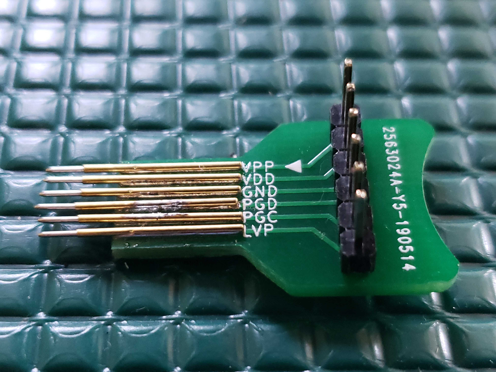
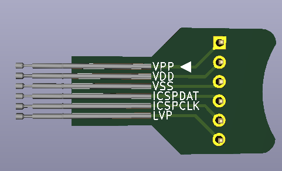
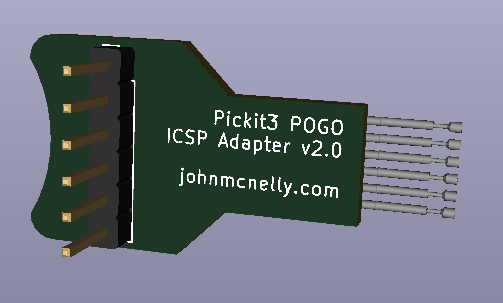
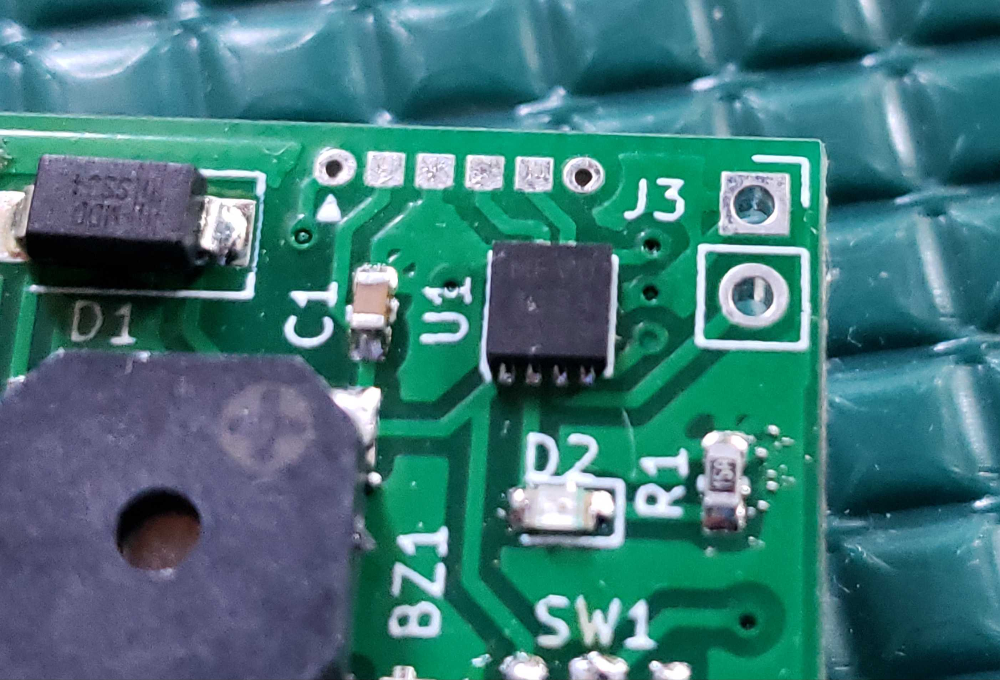
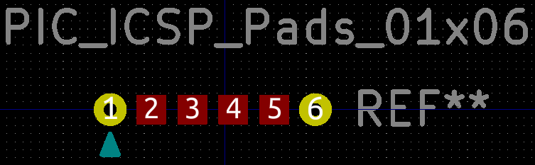
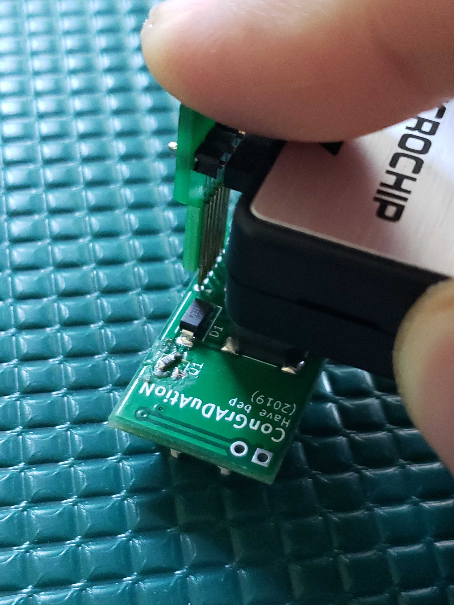

# Pickit3 ICSP Adapter

## Adapter
This board is a simple ICSP adapter meant for in-circuit programming of microcontrollers using the Pickit3.  The adapter board accepts a 2.54mm 6-wire jumper cable from the Pickit3 and breaks it out into POGO pins with 1.27mm pitch.

[Compatible POGO pins](https://www.amazon.com/gp/product/B07MZHXW1F)

## ICSP Pad Footprint
The ICSP pad footprint that is used by this board consists of a row of six pads with 1.27mm spacing.  The outermost two pads are circular with a diameter of 1mm and through-holes with a diameter of 0.4mm.  The innermost four pads are squares with edge length 1mm and no through holes.

## Usage Instructions
1. Center the tips of the POGO pins on the ICSP pads, making sure that the white arrow on the adapter lines up with the white arrow on both the programmer and the PCB footprint.
2. Depress the adapter, making sure that all POGO pins are creating solid contact with the PCB.
3. Program the device.

